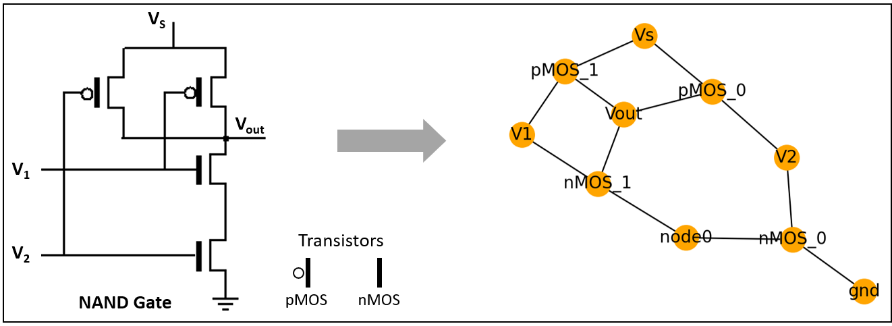

# Circuit Equivalence

This demonstration addresses the task of verifying the equivalence of two
representations of the design of an electronic circuit, which is of interest in
the field of electronic design automation.  By converting the representation of
each circuit into a graph, the problem can be reduced to that of determining
whether the two graphs are isomorphic.  The two graphs are said to be isomorphic
if there is a one-to-one-correspondence between the vertex sets such that the
adjacency relationships are identical.  Graph isomorphism is a problem of
general interest, and it is not currently known whether it is NP complete [1].

The following figure depicts the schematic representation of the CMOS NAND gate,
along with the corresponding graph:



## Usage

To run the demonstration using the default circuit definitions, use:

```bash
python equivalence.py --plot
```

The `--plot` flag is optional, and it causes a plot of the graphs of the two
circuits to be generated, using colors to indicate the identified node
correspondence.

## Code Overview

The code uses the following steps:

- First, each circuit is converted into a graph in which each element in the
  circuit is represented by a node in the graph, and edges are used to represent
  connections between the elements in the circuit
- Next, a discrete quadratic model (DQM) is constructed such that the energy
  function represents the problem of finding an isomorphism between the two
  graphs.  Further details are given in the next section.
- The DQM is then solved on the quantum computer using the LeapHybridSolver
- Each result in the sampler is then checked to determine whether (a) it
  indicates an isomorphism and (b) the identified isomorphism represents
  equivalent circuits (e.g., that a pMOS transistor in the first circuit is
  mapped to a pMOS transistor in the second).

The code is set up to read circuit definitions from netlist files in a simple
text format.  Several example netlist files are provided in the `netlists`
directory.  The `cmos_nand_1.txt` and `cmos_nand_2.txt` files describe the same
circuit, just using small changes to the naming of the components and the
ordering of the definitions in the netlists.  When running the demonstration
with these two files as input (the default), the code should identify that the
circuits are equivalent.  `cmos_nand_error.txt` is an example of an incorrect
specification of the CMOS NAND gate, which is not equivalent to the correct
representation.  `cmos_nor_1.txt` describes an implementation of the CMOS NOR
gate.  This circuit does produce a graph that is isomorphic with that of the CMOS
NAND gate, but with the pMOS and nMOS transistors swapped.  The example code
checks for matches in the transistor types of corresponding nodes identified by
the graph isomorphism, so it should determine that the NAND and NOR gate
netlists are not equivalent.

## Code Specifics

The core part of the code involves formulating the graph isomorphism problem as
a discrete quadratic model that can be solved on the D-Wave system.  The general
approach is based on that outlined by Lucas [2], which describes formulation as
a binary quadratic model.  In Lucas's formulation, there are `N*N` binary
variables `x_{v,i}` (N denotes that number of nodes in each graph, which must be
the same for there to be an isomorphism) that represent whether a vertex in the
first graph gets mapped to a vertex in the second graph.

The energy function is expressed as two components, `H_A` and `H_B` (Eqs. (71)
and (72) in [1]).  The first component, `H_A`, is used to enforce the constraint
that each vertex in each of the two graphs is selected exactly once:


We are able to simplify this term by taking advantage of the discrete quadratic
model representation.  Instead of using `N*N` binary variables, we use N
discrete variables, each having N cases.  We let each discrete variable
represent a node in the first graph, and the N cases represent nodes in the
second graph.  This way, the constraint of choosing each node in the first graph
once is implicitly enforced, and only the first of the two terms in the original
`H_A` equation is needed.

The second component, `H_B` (Eq. (72)), uses interaction terms to penalize
settings that select an edge in the first graph that is not in the second graph,
or vice versa:


The interaction coefficients associated with `H_B` are defined using two
double-loops.  Each double-loop includes an outer loop over the edges of one of
the two graphs, along with an inner loop over all possible node combinations, so
that penalty coefficients can be added for all combinations that are invalid.

The discrete quadratic model is then solved using the LeapHybridDQMSampler.  In
the original formulation given by [1], the ground state energy, which
corresponds to a graph isomorphism, is zero.  In the DQM formulation, the
constant value of 1 within the second summation in Eq. (71) for `H_A` is not
included, which results in the ground state energy being equal to `-N` instead
of 0.

To check for circuit equivalence, we check two conditions: first, there must be
an isomorphism between the two graphs.  This can be determined based on the
energy values found in the DQM solution.  Second, for each isomorphism, we check
that the corresponding circuit components are compatible.  For the examples
here, we simply check for compatible of transistors (nMOS cannot be swapped with
pMOS).

## References

[1] Johnson DS. The NP-completeness column. ACM Trans Algorith. (2005)
1:160. doi: 10.1145/1077464.1077476.

[2] Lucas, A. Ising formulations of many NP problems. Frontiers in
Physics, 2014. doi: 10.3389/fphy.2014.00005.

## License

Released under the Apache License 2.0. See [LICENSE](LICENSE) file.
